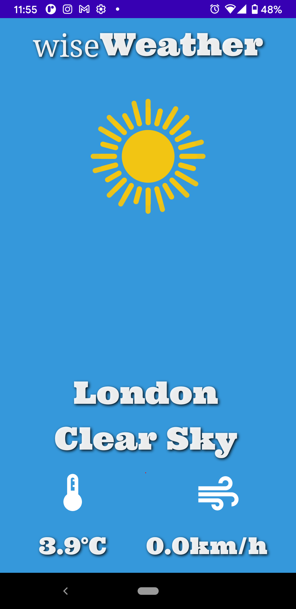
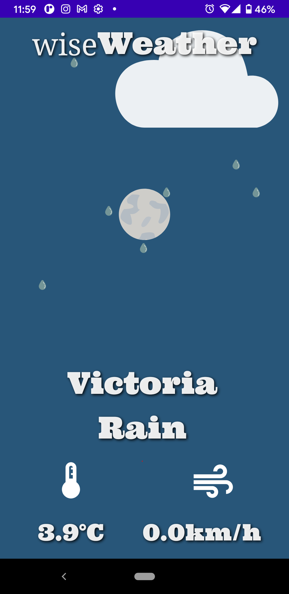
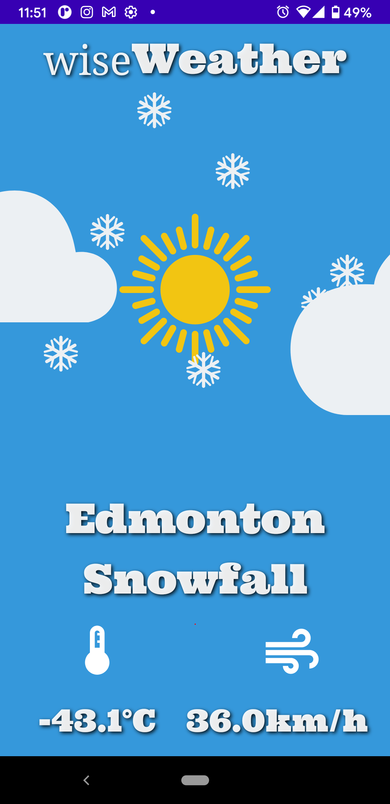
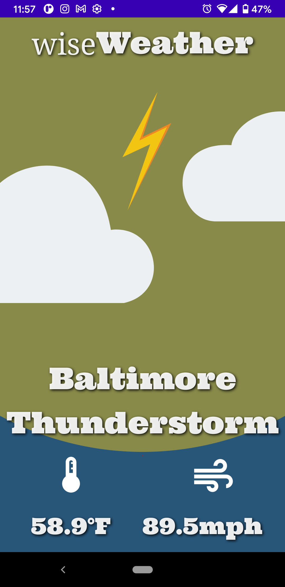

### Overview

wiseWeather is a simple application designed to provide convenient one touch access to current weather conditions. It does this by accessing a device's current coarse location via the Fused Location Client. 

The UI is made entirely with Jetpack Compose, and it features a variety of different animations for various weather patterns. A primary goal with most of my applications these days is to only use a library if it's appropriate to. So instead of using Retrofit to make a single HTTP request, I use HttpURLConnection (Java standard library). Instead of using GSON/Moshi, I wrote a simple Recursive Descent Parser using JsonReader (platform class).

### User Interface Examples
**Clear Sky Day**

**Rain Night**

**Snow Day**

**Thunder Night**

### Animations
[Clear Sky](/app/src/main/java/com/bracketcove/wiseweather/ui/animations/ClearSky.kt) - Sun and Stars on Clear days or night using alpha transitions
[Clouds](/app/src/main/java/com/bracketcove/wiseweather/ui/animations/Clouds.kt) - Variable animated clouds using x offset transitions
[Lightning](/app/src/main/java/com/bracketcove/wiseweather/ui/animations/Lightning.kt) - Flash lightning using scale and alpha transitions
[Rain](/app/src/main/java/com/bracketcove/wiseweather/ui/animations/Rain.kt) - Rain animations using y offset transitions
[Snow](/app/src/main/java/com/bracketcove/wiseweather/ui/animations/SNow.kt) - Snow animations using y and x offset transitions